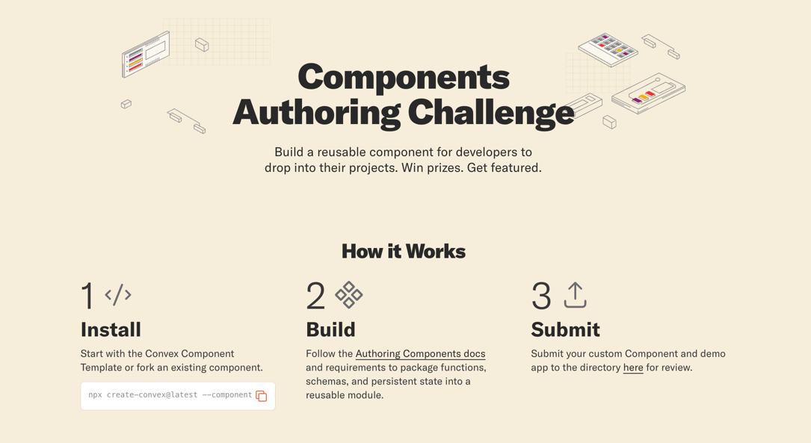

# Convex Components Challenge

Build reusable backend components for the Convex ecosystem. Ship something useful, get recognized, and earn rewards.

Change before tremendous

## What are Convex Components

Convex Components are self-contained TypeScript modules that add backend functionality to Convex app. Think of them as npm packages for your backend: authentication, file storage, rate limiting, analytics, or any reusable pattern you find yourself rebuilding across projects.

Components have their own tables, functions, and scheduled jobs. They install with npm and wire into your existing Convex app without touching your schema.

## The Challenge

See the list of **[components challenges and rewards here.](https://github.com/orgs/get-convex/projects/1/views/1)**

We're looking for developers to build and submit components.

Each challenge focuses on a specific use case or pattern in the following categories:

- Auth / Identity
- AI / Agent Infrastructure
- Analytics
- API Usage
- Content Management
- Full-Stack Drop-In Features
- Storage
- Third-Party Sync

Visit the [Components Directory](https://www.convex.dev/components) to see existing components and find inspiration.

## Rewards

Selected components receive:

- Featured placement on the [Components Directory](https://www.convex.dev/components)
- $100 gift card or more
- Convex swag

## How to Participate

1. Build a convex component you need or pick challenge from the **[ components challenge list](https://github.com/orgs/get-convex/projects/1/views/1)**
2. Follow the [authoring guide](https://docs.convex.dev/components/authoring) to structure your component
3. Publish to npm
4. [Submit your component](https://www.convex.dev/components/submit) for review

## Resources

Learn how components work and how to build them:

| Resource                                                                     | Description                                              |
| ---------------------------------------------------------------------------- | -------------------------------------------------------- |
| [Understanding Components](https://docs.convex.dev/components/understanding) | Architecture and concepts behind Convex Components       |
| [Using Components](https://docs.convex.dev/components/using)                 | How to install and integrate components into your app    |
| [Authoring Components](https://docs.convex.dev/components/authoring)         | Step by step guide to building your own component        |
| [Submit a Component](https://www.convex.dev/components/submit)               | Submit your component for review and potential featuring |
| [Components Directory](https://www.convex.dev/components)                    | Browse existing components                               |

## Component Requirements

A valid Convex Component needs:

- A `convex.config.ts` that defines the component
- Exported functions that other apps can call
- Published to npm with the right entry points
- Documentation showing how to install and use it

The [authoring guide](https://docs.convex.dev/components/authoring) covers the full specification.

## Questions

Join the [Convex Discord](https://convex.dev/community) and ask in the component authoring channel channel.
